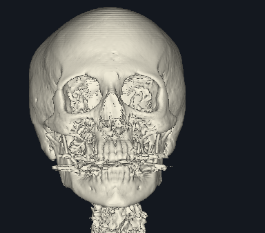

# Skull — rendu volumique 3D d’un scanner de tête

Skull est une application C++/OpenGL pédagogique qui permet d’explorer le jeu de données **CThead** : 113 coupes CT de tête, chacune composée de 256 × 256 pixels.



Cette image est produite par le programme lui-même, en mode osseux. Le rendu est calculé à partir des voxels du scanner ; il ne s’agit pas d’un modèle 3D polygonal préfabriqué.

## Fonctionnalités

- visualisation des tissus et du squelette par seuil d’intensité ;
- rendu volumique avec transparence et composition avant-arrière ;
- coupes en niveaux de gris avec réglage de fenêtre et de niveau ;
- éclaté composé de cinq coupes réelles du volume CThead ;
- vue pédagogique de la peau et d’un cerveau estimé par transfert d’intensité ;
- légende intégrée rappelant les couches disponibles et les commandes ;
- rotation progressive au clavier et navigation dans les coupes.

Le jeu CThead ne fournit pas de masques séparés pour le cerveau, les méninges ou les artères. La vue cerveau est donc une estimation visuelle, et l’affichage des artères demanderait un angio-CT avec produit de contraste et une segmentation dédiée.

## Installation et lancement

Sur macOS, installer les outils de compilation Xcode et GLFW :

```sh
brew install glfw
./launch.sh
```

Le lancement équivaut à :

```sh
make
./bin/skull
```

Le programme utilise par défaut `data/cthead/`. Pour fournir un autre volume :

```sh
./bin/skull --data /chemin/vers/cthead
```

Une construction CMake est également disponible :

```sh
cmake -S . -B build -DCMAKE_BUILD_TYPE=Release
cmake --build build
./build/skull
```

Sous Linux, GLFW, OpenGL, `pkg-config` et un compilateur compatible C++11 sont nécessaires. Cette plateforme n’a pas été validée dans cette session.

## Commandes

| Touche | Action |
| --- | --- |
| `1` | Surface des tissus |
| `2` / `3` | Comparaison tissus/os sur les deux moitiés |
| `4` | Surface osseuse |
| `5` | Transparence volumique |
| `6` | Coupe en niveaux de gris |
| `7` | Éclaté de cinq coupes réelles CThead |
| `8` | Peau translucide et cerveau estimé |
| `+` / `-` | Augmenter ou diminuer l’opacité des modes concernés |
| Molette, `[` / `]` | Déplacer la coupe |
| Début / Fin | Première ou dernière position de coupe |
| `C` | Activer ou désactiver la découpe devant le plan |
| `H` | Afficher ou masquer la légende |
| Flèches | Tourner progressivement la vue, par pas de 8° |
| `X` / `Y` / `Z` | Choisir une orientation axiale, coronale ou sagittale |
| `o` / `O` | Diminuer ou augmenter le seuil osseux |
| `t` / `T` | Diminuer ou augmenter le seuil des tissus |
| `w` / `W` | Réduire ou élargir la fenêtre de niveaux de gris |
| `l` / `L` | Diminuer ou augmenter le niveau central |
| `R` | Réinitialiser la vue et les réglages |
| Échap | Quitter |

Les réglages courants sont rappelés dans le titre de la fenêtre. Les touches `[` et `]` sont complétées par la molette et les touches Page haut/Page bas pour faciliter l’usage sur un clavier AZERTY.

## Comment le rendu 3D fonctionne

### Des coupes aux voxels

Les 113 fichiers sont lus comme des valeurs 16 bits big-endian. Chaque valeur représente l’intensité d’un voxel. Le programme empile les coupes pour former un volume 3D, puis conserve les dimensions et les pas spatiaux lors des changements d’orientation.

Le volume original a un rapport d’espacement **1:1:2**. Après réorganisation pour l’affichage, les pas utilisés sont `(1, 2, 1)`. L’étendue visuelle suit la distance entre les centres des voxels : `(dimension - 1) × pas`. Cette règle évite d’étirer le crâne lorsque les coupes sont plus espacées que les pixels.

### Projection volumique

Pour chaque pixel de la fenêtre, le moteur lance un rayon à travers le volume. Il échantillonne les voxels sur ce rayon, transforme leur intensité en couleur et opacité, puis les compose dans l’ordre de profondeur. Les faibles opacités laissent apparaître les structures situées derrière ; l’accumulation s’arrête lorsqu’elle est suffisamment opaque pour éviter des calculs inutiles.

Les modes `1`, `2`, `3`, `4`, `5` et `8` utilisent des transferts d’intensité différents. Ils ne produisent pas des organes anatomiques segmentés : un seuil regroupe des intensités qui peuvent appartenir à plusieurs tissus.

### Coupes, transparence et contraste

La touche `C` retire la partie située devant le plan de coupe dans les modes volumétriques. Le mode `6` affiche ce plan en niveaux de gris et applique une fenêtre d’intensité ainsi qu’un niveau central. Le même repère de coupe est conservé lors du changement de mode.

La texture affichée est interpolée bilinéairement pour limiter les escaliers. La fenêtre OpenGL est dimensionnée avec la résolution réelle du framebuffer, y compris sur les écrans Retina. Le volume est centré et son rapport physique est conservé.

Les flèches modifient une rotation de présentation en espace écran, par petites étapes. Cela rend l’interaction fluide et synchronise la rotation des couches et de l’éclaté. Les touches `X`, `Y` et `Z` rechargent quant à elles les orientations du volume et recalculent les dimensions associées.

Le moteur calcule l’image CPU lors d’un changement de réglage, puis l’envoie à OpenGL sous forme de texture. Cette approche rend le code lisible et portable, mais limite le rendu à une résolution de calcul de 384 pixels sur le grand axe. OpenGL 2.1 est utilisé pour rester compatible avec l’environnement macOS ciblé.

## Données et limites scientifiques

Les données sont les fichiers originaux `CThead.1` à `CThead.113`, conservés dans `data/cthead/`. Leur provenance, les empreintes et les licences sont détaillées dans [docs/SOURCES_AND_LICENSES.md](docs/SOURCES_AND_LICENSES.md).

Le volume ne contient pas de métadonnées DICOM complètes, de repère patient fiable, de latéralité gauche/droite établie ou de conversion revendiquée en unités Hounsfield. Les affichages sont destinés à l’exploration technique et pédagogique, pas au diagnostic médical.

## Organisation du dépôt

```text
src/main.cpp                  Application GLFW, commandes et légende
src/volume_renderer.cpp       Chargement, géométrie, rendu et coupes
include/volume_renderer.h     Interface du moteur de rendu
data/cthead/                  113 coupes originales
data/cthead_original/         Archive source, notices et SHA-256
tests/renderer_test.cpp       Tests du moteur sans fenêtre
docs/SOURCES_AND_LICENSES.md  Provenance et licences
docs/assets/skull-render.png  Capture produite par le programme
```

Les anciennes versions GLUT, les binaires générés et la série convertie à 94 coupes ont été retirés afin de garder un seul chemin de rendu.

## Vérifier le projet

```sh
make test
cmake -S . -B build -DCMAKE_BUILD_TYPE=Release
cmake --build build
ctest --test-dir build --output-on-failure
```

Pour exporter les six modes de base sans ouvrir de fenêtre :

```sh
mkdir -p /tmp/skull-images
./bin/skull --snapshots /tmp/skull-images
```

Le dossier de destination doit exister. `./bin/skull --help` affiche les options disponibles.

## Sources et licences

Le jeu CThead est attribué à l’**University of North Carolina**, au **North Carolina Memorial Hospital** et à l’archive de données de **Stanford University**. Le code historique fourni avec l’exemple est attribué à **Michel Grave** ; sa licence de redistribution n’est pas explicitement établie dans les sources disponibles. GLFW est utilisé sous licence zlib/libpng.

Les références et les textes de licence sont regroupés dans [docs/SOURCES_AND_LICENSES.md](docs/SOURCES_AND_LICENSES.md) et [docs/GLFW-LICENSE.md](docs/GLFW-LICENSE.md).
