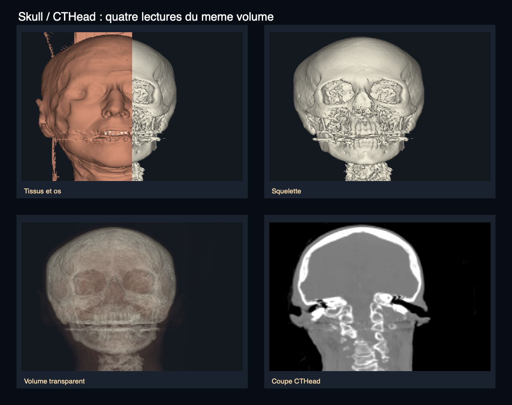

# Skull : rendu volumique 3D d’un scanner de tête

Skull est un petit lecteur C++/OpenGL pour parcourir un scanner CT de tête. Il utilise le jeu de données **CTHead**, qui contient 113 coupes de 256 × 256 pixels.



Cette planche rassemble quatre sorties du programme : la comparaison tissus/os, le squelette, la transparence volumique et une coupe CT. Elles viennent du même volume CTHead et permettent de voir en un coup d’œil ce que changent les différents modes de rendu. Une capture du seul mode osseux reste disponible dans [docs/assets/skull-render.png](docs/assets/skull-render.png).

## Fonctionnalités

- faire ressortir les tissus ou les os en réglant leur seuil d’intensité ;
- traverser le volume avec un rendu transparent ;
- afficher une coupe en niveaux de gris et régler son contraste ;
- séparer cinq coupes réelles pour comprendre la profondeur du volume ;
- rendre la peau transparente pour laisser deviner une couche cérébrale ;
- afficher les commandes directement dans la fenêtre ;
- tourner la vue au clavier et parcourir les coupes à la molette.

Le jeu de données CTHead ne contient pas de masques séparés pour le cerveau, les méninges ou les artères. La vue du cerveau est donc une approximation fondée sur les intensités. Pour voir les artères correctement, il faudrait un angio-CT avec produit de contraste et une segmentation adaptée.

## Installation et lancement

Sur macOS, il faut Xcode (ou ses outils de ligne de commande) et GLFW :

```sh
brew install glfw
./launch.sh
```

Le lancement manuel se fait ainsi :

```sh
make
./bin/skull
```

Le programme utilise par défaut `data/cthead/`. Pour fournir un autre volume :

```sh
./bin/skull --data /chemin/vers/cthead
```

Si tu préfères CMake :

```sh
cmake -S . -B build -DCMAKE_BUILD_TYPE=Release
cmake --build build
./build/skull
```

Sous Linux, installe GLFW, OpenGL, `pkg-config` et un compilateur C++11. Le projet a été vérifié sur macOS ; le support Linux reste à tester.

## Commandes

| Touche | Action |
| --- | --- |
| `1` | Surface des tissus |
| `2` / `3` | Comparaison tissus/os sur les deux moitiés |
| `4` | Surface osseuse |
| `5` | Transparence volumique |
| `6` | Coupe en niveaux de gris |
| `7` | Éclaté de cinq coupes réelles du jeu de données CTHead |
| `8` | Peau translucide et cerveau estimé |
| `+` / `-` | Augmenter ou diminuer l’opacité des modes concernés |
| Molette, `[` / `]` | Déplacer la coupe |
| Début / Fin | Première ou dernière position de coupe |
| `C` | Activer ou désactiver la découpe devant le plan |
| `H` | Afficher ou masquer la légende |
| Flèches | Tourner progressivement la vue, par pas de 8° |
| `X` / `Y` / `Z` | Choisir une orientation axiale, coronale ou sagittale |
| `o` / `O` | Diminuer ou augmenter le seuil osseux |
| `t` / `T` | Diminuer ou augmenter le seuil des tissus |
| `w` / `W` | Réduire ou élargir la fenêtre de niveaux de gris |
| `l` / `L` | Diminuer ou augmenter le niveau central |
| `R` | Réinitialiser la vue et les réglages |
| Échap | Quitter |

Le titre de la fenêtre affiche les réglages en cours. Sur un clavier AZERTY, la molette et Page haut/Page bas sont plus simples à utiliser que `[` et `]`.

## Comment le rendu 3D fonctionne

### Des coupes aux voxels

Le programme lit les 113 fichiers comme des valeurs 16 bits big-endian. Chaque valeur donne l’intensité d’un voxel. Il empile ensuite les coupes pour former le volume 3D et met à jour ses dimensions quand tu changes de vue.

Les pixels et les coupes n’ont pas la même profondeur : le rapport d’espacement d’origine est **1:1:2**. Le moteur utilise donc `(1, 2, 1)` après réorganisation des axes. Il calcule la taille à partir de `(dimension - 1) × pas`, ce qui évite d’écraser ou d’étirer le crâne.

### Projection volumique

Pour chaque pixel de la fenêtre, le moteur lance un rayon à travers le volume. Il relève plusieurs voxels sur ce rayon, convertit leurs intensités en couleurs et les mélange de l’avant vers l’arrière. Une faible opacité laisse voir ce qui se trouve derrière ; le calcul s’arrête quand le rayon est déjà presque opaque.

Les modes `1`, `2`, `3`, `4`, `5` et `8` utilisent chacun leur propre transfert d’intensité. Un seuil rassemble des valeurs proches : il peut donc inclure plusieurs tissus et ne constitue pas une segmentation anatomique.

### Coupes, transparence et contraste

Avec `C`, tu retires la partie du volume située devant le plan de coupe. Le mode `6` montre ce plan en niveaux de gris avec une fenêtre et un niveau réglables. La position de la coupe reste la même quand tu changes de mode.

OpenGL interpole la texture bilinéairement pour réduire l’effet d’escalier. La fenêtre utilise la vraie taille du framebuffer, y compris sur un écran Retina. Le volume reste centré et garde ses proportions physiques.

Les flèches font tourner l’image par petits pas de 8°. La rotation reste fluide et s’applique de la même façon aux couches et à l’éclaté. Les touches `X`, `Y` et `Z` changent l’orientation du volume et recalculent les dimensions correspondantes.

Le moteur calcule l’image sur le CPU quand un réglage change, puis l’envoie à OpenGL comme une texture. Le code reste simple et portable, au prix d’une résolution de calcul limitée à 384 pixels sur le grand axe. Le projet utilise OpenGL 2.1 pour fonctionner avec l’environnement macOS ciblé.

## Données et limites scientifiques

Les données sont les fichiers originaux `CThead.1` à `CThead.113`, conservés dans `data/cthead/`. Leur provenance, les empreintes et les licences sont détaillées dans [docs/SOURCES_AND_LICENSES.md](docs/SOURCES_AND_LICENSES.md).

Le volume ne contient pas de métadonnées DICOM complètes, de repère patient fiable, de latéralité gauche/droite établie ou de conversion revendiquée en unités Hounsfield. Les affichages sont destinés à l’exploration technique et pédagogique, pas au diagnostic médical.

## Organisation du dépôt

```text
src/main.cpp                  Application GLFW, commandes et légende
src/volume_renderer.cpp       Chargement, géométrie, rendu et coupes
include/volume_renderer.h     Interface du moteur de rendu
data/cthead/                  113 coupes originales
data/cthead_original/         Archive source, notices et SHA-256
tests/renderer_test.cpp       Tests du moteur sans fenêtre
docs/SOURCES_AND_LICENSES.md  Provenance et licences
docs/assets/skull-render.png  Capture produite par le programme
```

Les anciennes versions GLUT, les binaires générés et la série convertie à 94 coupes ne font plus partie du dépôt. Il reste un seul chemin de rendu à maintenir.

## Vérifier le projet

```sh
make test
cmake -S . -B build -DCMAKE_BUILD_TYPE=Release
cmake --build build
ctest --test-dir build --output-on-failure
```

Pour exporter les six modes de base sans ouvrir de fenêtre :

```sh
mkdir -p /tmp/skull-images
./bin/skull --snapshots /tmp/skull-images
```

Le dossier de destination doit exister. `./bin/skull --help` affiche les options disponibles.

## Sources et licences

Le jeu de données CTHead est attribué à l’**University of North Carolina**, au **North Carolina Memorial Hospital** et à l’archive de données de **Stanford University**. Le code historique fourni avec l’exemple est attribué à **Michel Grave** ; sa licence de redistribution n’est pas explicitement établie dans les sources disponibles. GLFW est utilisé sous licence zlib/libpng.

Les références et les textes de licence sont regroupés dans [docs/SOURCES_AND_LICENSES.md](docs/SOURCES_AND_LICENSES.md) et [docs/GLFW-LICENSE.md](docs/GLFW-LICENSE.md).
